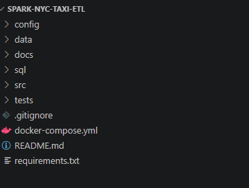
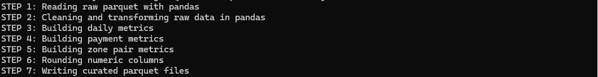

# 🚕 End-to-End Spark ETL Pipeline for NYC Taxi Trip Analytics

## 📌 Overview

This project implements a **modular end-to-end ETL pipeline** using real NYC Taxi trip data.
It demonstrates how raw data is ingested, validated, transformed, and converted into **analytics-ready datasets**.

The pipeline is designed to simulate **real-world data engineering workflows**, combining PySpark transformations with a curated analytics layer.

---

## 🎯 Business Problem

Raw mobility datasets are not directly usable for analysis.
Organizations need pipelines that:

* clean and validate large datasets
* remove inconsistent or unrealistic records
* produce reliable business metrics

This project simulates how data engineers prepare **analytics-ready datasets** for reporting and decision-making.

---

## 📥 Dataset

The dataset used in this project is too large to be included in the repository.

You can download it from the official NYC Taxi dataset source:

https://www.nyc.gov/site/tlc/about/tlc-trip-record-data.page

After downloading, place the file in:

data/raw/yellow_tripdata_2026-01.parquet

---

## 🧰 Tech Stack

* Python
* PySpark
* Pandas
* PostgreSQL (Docker)
* SQLAlchemy
* pg8000

---

## 🏗️ Project Structure

```
spark-nyc-taxi-etl/
├── config/
│   └── config.yaml
├── data/
│   ├── raw/
│   ├── processed/
│   └── curated/
├── docs/
├── sql/
│   ├── create_tables.sql
│   └── analytics_queries.sql
├── src/
│   ├── extract.py
│   ├── validate.py
│   ├── transform.py
│   ├── load.py
│   ├── main.py
│   └── curated_layer.py
├── tests/
├── docker-compose.yml
├── requirements.txt
├── README.md
```

---

## ⚙️ Pipeline Architecture

### 🔹 Stage 1: Spark Transformation Pipeline

Implemented in `main.py`

* Read raw parquet dataset
* Validate required columns
* Apply data quality filters
* Perform transformations and feature engineering

---

### 🔹 Stage 2: Curated Analytics Layer

Implemented in `curated_layer.py`

* Generate aggregated datasets
* Produce analytics-ready outputs

---

## 🧹 Data Quality Rules

The pipeline enforces:

* valid timestamps
* trip distance > 0
* non-negative fare and total amounts
* passenger count between 1 and 6
* trip duration between 1 and 300 minutes
* realistic speed ranges

---

## 📈 Outputs Generated

### Processed Layer

* cleaned trip-level dataset

### Curated Layer

* `agg_daily_trip_metrics.parquet`
* `agg_payment_type_metrics.parquet`
* `agg_zone_pair_metrics.parquet`

---

## 📊 Example Metrics

* total trips per day
* average trip distance
* average trip duration
* total revenue
* payment method distribution
* top pickup/dropoff zones

---

## 🚀 How to Run the Project

### 1️⃣ Clone repository

```
git clone https://github.com/ernest-oppong/spark-nyc-taxi-etl.git
```

---

### 2️⃣ Install dependencies

```
pip install -r requirements.txt
```

---

### 3️⃣ Add dataset

Place file in:

```
data/raw/yellow_tripdata_2026-01.parquet
```

---

### 4️⃣ Run Spark pipeline

```
python src/main.py
```

---

### 5️⃣ Run curated pipeline

```
python src/curated_layer.py
```

---

### 6️⃣ Verify outputs

```
dir data\curated
```
## 📊 Results

The pipeline successfully produces analytics-ready datasets:

- Daily trip metrics (volume, revenue, distance)
- Payment method distribution analysis
- Zone-to-zone trip performance insights

These outputs can be directly used for reporting, dashboards, or business analysis.
---

## 📸 Screenshots

### Project Structure



### Spark Pipeline Run


### Curated Pipeline Run



### Curated Outputs


---

## 🗄️ Database Layer (Optional)

PostgreSQL integration is included via Docker.

```
docker compose up -d
```

The database load is optional in local environments due to possible authentication or system-specific issues.

---

## ⚠️ Local Environment Notes

* Spark write operations may fail on Windows due to Hadoop (`winutils`) limitations
* Pandas is used to ensure reliable output generation
* PostgreSQL loading is optional depending on environment configuration

---

## 🔮 Future Improvements

* run full pipeline in Linux/WSL
* add Airflow orchestration
* implement streaming with Kafka
* add dashboard (Power BI / Tableau)

---

## 👤 Author

Built as a portfolio project to demonstrate:

* ETL pipeline design
* PySpark transformation logic
* data validation and cleaning
* modular project structure
* real-world dataset handling

---

## ⭐ Key Takeaway

This project demonstrates how raw data is transformed into **analytics-ready datasets**, reflecting real-world data engineering practices.
